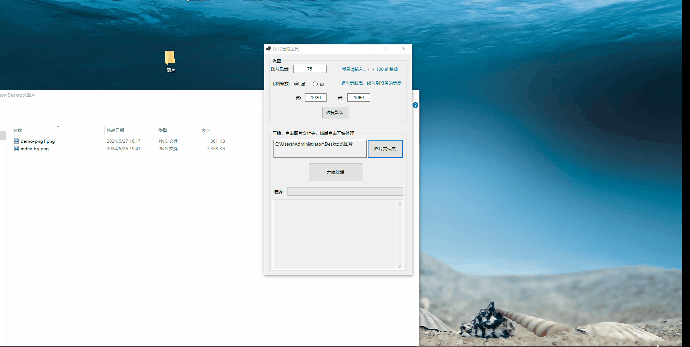

# Tool.CompressImage
- 图片压缩工具
- 运行环境 .NET 8.0
- Nuget: SixLabors.ImageSharp

# 其他说明

- 图片质量：质量越高，图片的质量高，相应的图片容量越大
- 比例缩放：
  - 选否时，不对图片进行等比例缩放
  - 选是时，如果原始图片的宽超过了设定的宽度，或者原始图片的高超过了设定的高度。压缩后的图片将按照设置的宽和高进行等比例缩放
- 恢复默认：恢复默认设置参数
- 图片文件夹，选择要压缩的图片位置，点击开始处理进行压缩图片
